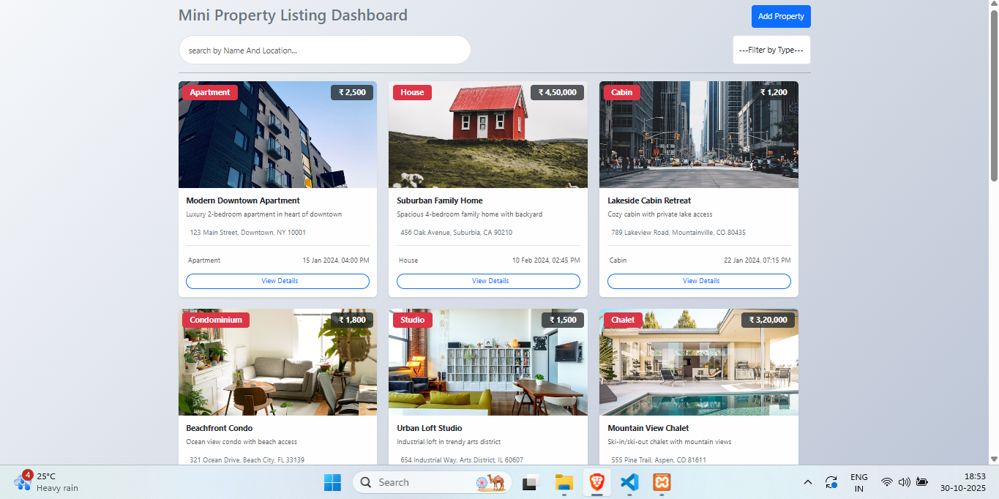
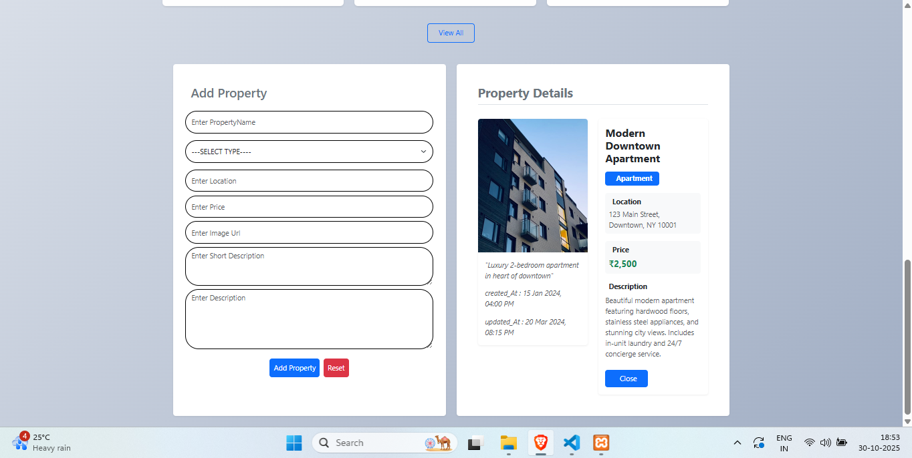
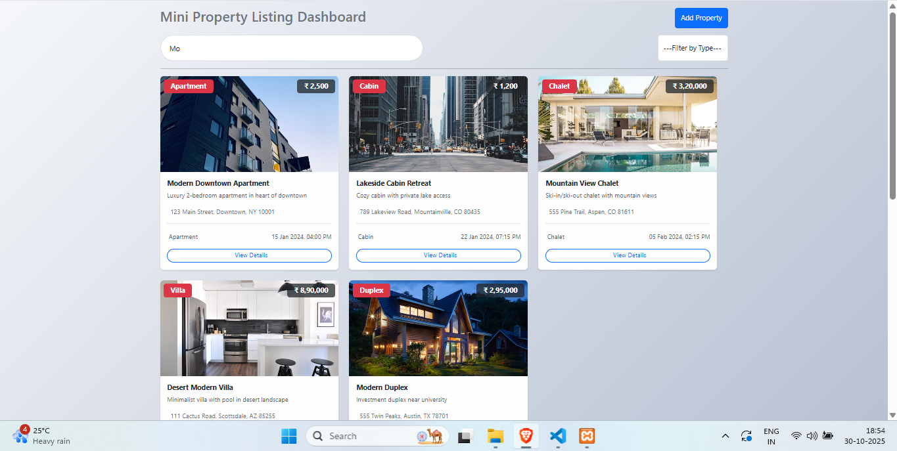

# Portfolio App - Dron TV Assessment

A modern portfolio application built with cutting-edge technologies that allows users to create, edit, and showcase their professional profiles with multiple template options.

## 🛠️ Built With

<div align="center" style="display: flex; justify-content: center; gap: 20px; flex-wrap: wrap; margin: 30px 0;">
  
  
  
  
</div>

This application utilizes a modern tech stack including React.js for the frontend, Node.js with Express.js for the backend server, and Bootstrap for responsive styling. Data is managed through JSON files for seamless operation.
## 📥 Installation Steps

Follow these steps to set up the project locally:

### Prerequisites
- **Node.js** (v14 or higher)
- **npm** (Node Package Manager)
- **MySQL** Server

### Installation Guide

1. **Install Node.js and npm**
   ```bash
   # Download and install from https://nodejs.org/
   node --version
   npm --version
   ```

2. **Clone the Project**
   ```bash
     git clone https://github.com/Sohailshaikh5656/PortfolioPro.git
    cd portfolio-app
   ```

3.**Backend Setup**
```bash
   # In backend directory
    npm install
    nodemon start
    # Server will run on http://localhost:3300
```

4.**Frontend Setup**
```bash
    # Open new terminal, navigate to frontend
    cd ../frontend
    npm install
    npm start
    # App will run on http://localhost:3000
```


📁 **Project Structure**
```bash
property-app/
├── backend/
│   ├── config/
│   │   └── properties.json
│   ├── routes/
│   ├── middleware/
│   ├── package.json
│   └── server.js
├── frontend/
│   ├── public/
│   ├── src/
│   │   ├── components/
│   │   ├── pages/
│   │   ├── styles/
│   │   ├── data/
│   │   └── App.js
│   ├── package.json
│   └── README.md
└── README.md```
<br />
✨ **Features**
<br />
<ul> <li><strong>🏠 Advanced Property Search</strong> <ul> <li>Smart search with location-based filtering</li> <li>Price range and property type filters</li> <li>Bedrooms and bathrooms count filtering</li> <li>Real-time search results</li> </ul> </li> <li><strong>🎨 Modern User Interface</strong> <ul> <li>Clean and intuitive design with Bootstrap</li> <li>Responsive layout for all devices</li> <li>Interactive property cards with hover effects</li> <li>Easy navigation and user-friendly interface</li> </ul> </li> <li><strong>📝 Add Property Form</strong> <ul> <li>Comprehensive property addition form</li> <li>Image upload functionality</li> <li>Form validation and error handling</li> <li>Multiple property type options</li> </ul> </li> <li><strong>⚡ Single Page Application</strong> <ul> <li>Fast and seamless user experience</li> <li>No page reloads during navigation</li> <li>Smooth transitions and animations</li> <li>Optimized performance</li> </ul> </li> <li><strong>📊 Property Management</strong> <ul> <li>View all property listings</li> <li>Edit existing property details</li> <li>Delete property listings</li> <li>Property status management</li> </ul> </li> <li><strong>🔍 Enhanced Filtering</strong> <ul> <li>Multiple filter combinations</li> <li>Sort by price, date, and popularity</li> <li>Save favorite properties</li> <li>Quick view property details</li> </ul> </li> <li><strong>📱 Mobile Responsive</strong> <ul> <li>Optimized for mobile devices</li> <li>Touch-friendly interface</li> <li>Mobile-first design approach</li> <li>Cross-browser compatibility</li> </ul> </li> </ul>
<br/>
📸 **Project Demo**

<div align="center">
<hr />

<br />
<hr />

<br />
<hr />

<br />
<hr />
  
👨‍💻 **Author**
Shaikh Sohel

🎓 MCA @ LJ Campus
🎓 BCA @ Govt. K.K. Shastri College

💼 Technical Training in:

React.js
Node.js
Next.js
MySQL

<div align="center">
⭐ Star this repository if you find it helpful!
</div> ```
</div>
